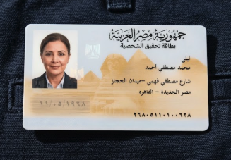
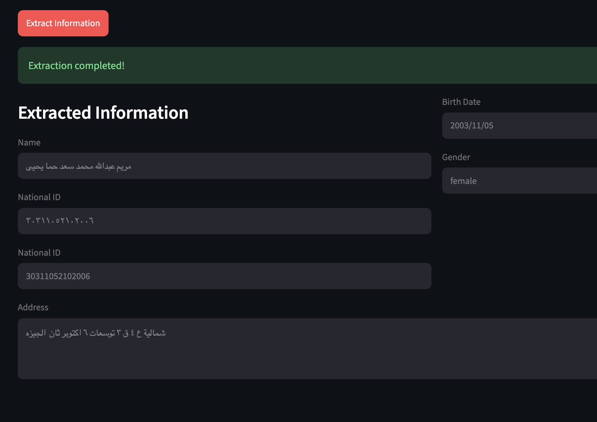

# National ID OCR

A Python-based OCR pipeline for extracting structured data from Egyptian national ID cards. The project combines image preprocessing, contour detection, perspective correction, and OCR to detect identifying fields such as the holder name, address, national ID number, gender, and birth date.

This repository currently focuses on the backend OCR API, which exposes a FastAPI endpoint for processing uploaded card images.

## Demo

Example input and output views from the OCR workflow:

### ID Card Input



### Extraction Result




## Overview

The application performs the following steps:

- Loads an uploaded image
- Preprocesses and enhances the image for detection
- Finds the card contour in the image
- Applies perspective correction to normalize the card orientation
- Isolates key regions on the ID card
- Runs OCR over those regions
- Normalizes extracted values and returns structured output

## Features

- Egyptian national ID card preprocessing and field extraction
- OCR-based text recognition for card fields
- Perspective correction for skewed or rotated images
- Structured JSON response with extracted data
- FastAPI endpoint for image upload processing
- Docker support for containerized deployment

## Tech Stack

- Python 3.13
- FastAPI
- PaddleOCR
- OpenCV (`cv2`)
- NumPy
- Streamlit frontend

## Project Structure

```text
National_IDOCR/
├── backend/
│   ├── api/
│   │   └── routes.py         # FastAPI routes for image processing
│   └── app/
│       └── core/
│           ├── ingestion.py  # Image loading and pipeline setup
│           ├── preprocessing.py  # Image enhancement and field extraction
│           ├── ocr.py        # OCR wrapper logic
│           ├── extractor.py  # Region extraction and value conversion
│           ├── models.py     # Data models
│           └── worker.py     # Reusable processing worker
├── frontend/
│   ├── app.py                # Streamlit frontend
│   └── requirements.txt      # Streamlit Cloud dependencies
├── main.py                    # Entry extraction function used by the API
├── Dockerfile                 # Container configuration
├── pyproject.toml             # Python dependencies and project metadata
├── README.md                  # Project documentation
└── notebook.ipynb             # Notebook-based experimentation
```

## Prerequisites

- Python 3.13 recommended (matches `pyproject.toml`)
- `pip` or `uv`
- A system capable of running OpenCV and PaddleOCR dependencies
- For local development, a virtual environment is recommended

## Installation

### Option 1: Using `uv` (recommended)

```bash
cd National_IDOCR
uv sync
```

### Option 2: Using `pip`

```bash
cd National_IDOCR
python -m venv .venv
source .venv/bin/activate
python -m pip install -e .
```

> This project is configured with `pyproject.toml` and uses `uv` in the Docker setup, so `uv sync` is the simplest path for local development.

## Running the API

From the project root:

```bash
cd National_IDOCR
uv run uvicorn backend.api.routes:app --host 0.0.0.0 --port 8000 --reload --reload-dir backend
```

Or, if your environment is already activated:

```bash
python -m uvicorn backend.api.routes:app --host 0.0.0.0 --port 8000 --reload --reload-dir backend
```

Once started, the API will be available at:

- `http://localhost:8000/` — health/root endpoint
- `http://localhost:8000/CardProcessings` — upload an ID card image

## API Endpoint

### `GET /`

Returns a simple welcome message.

Example response:

```json
{
  "message": "Welcome to the ID OCR API"
}
```

### `POST /CardProcessings`

Uploads an ID card image and returns extracted structured data.

#### Request format

- `file`: multipart form file upload

#### Example using curl

```bash
curl -X POST "http://localhost:8000/CardProcessings" \
  -F "file=@/path/to/id_card.jpg"
```

#### Example response

```json
{
  "name": "John Doe",
  "address": "123 Example Street",
  "id_number": "12345678901234",
  "factory_number": "AB12345",
  "gender": "male",
  "birth_date": "1995/07/14",
  "english_id_number": "12345678901234",
  "photo": "base64-encoded-image-data"
}
```

## Docker

The project includes a Dockerfile for containerized execution.

Build the image:

```bash
docker build -t national-idocr .
```

Run the container:

```bash
docker run -p 7860:7860 national-idocr
```

The container starts the API on port `7860` by default, which is required by
Hugging Face Spaces. To run the container locally on port `8000`, use:

```bash
docker run -e PORT=8000 -p 8000:8000 national-idocr
```

Both configurations expose the same FastAPI endpoint described above.

## Public Demo Deployment

The frontend and backend are deployed as separate services:

```text
User -> Streamlit Community Cloud -> HTTPS -> Render FastAPI service
```

### Hugging Face Spaces deployment

This repository can also run as a free CPU Docker Space. Create a new Space
with **Docker** as the SDK, then upload or push this repository. The metadata
above configures the Space to expose port `7860`. The container starts the
FastAPI application at `backend.api.routes:app`.

After the Space builds, use its URL as the Streamlit backend URL:

```toml
BACKEND_URL = "https://<space-owner>-<space-name>.hf.space"
```

Verify the Space before configuring Streamlit:

```bash
curl https://<space-owner>-<space-name>.hf.space/
open https://<space-owner>-<space-name>.hf.space/docs
```

The first request can be slow while PaddleOCR downloads its models. The free
CPU Space may sleep when idle, and model files can be downloaded again after a
restart. Upload only synthetic/test images.

The backend application is `backend.api.routes:app`, and the OCR endpoint is
`POST /CardProcessings`. PaddleOCR is configured for CPU inference by default;
the application does not use `torch` or CUDA directly.

### Deploy the backend on Render

Create a **Web Service** from this repository with:

- Build command: `pip install -r requirements.txt`
- Start command: `uvicorn backend.api.routes:app --host 0.0.0.0 --port $PORT`
- Health check path: `/`
- Python version: `3.13.0` (also declared in `render.yaml`)

Render can use the included `render.yaml` to prefill these settings. After the
service deploys, verify `https://<backend-url>/docs` and
`https://<backend-url>/`. Test the OCR route with:

```bash
curl -X POST "https://<backend-url>/CardProcessings" \
  -F "file=@/path/to/synthetic_id_card.jpg"
```

The first request may be slow because PaddleOCR downloads and initializes its
models. The free Render service may also sleep when idle. Model files are
stored in the service filesystem and may need to be downloaded again after a
restart; no persistent disk is required for this demo.

### Deploy the frontend on Streamlit Community Cloud

1. Create a new app from this repository.
2. Set the main file to `frontend/app.py`.
3. In the app settings, add the secret:

```toml
BACKEND_URL = "https://<backend-url>"
```

Streamlit exposes this secret as the `BACKEND_URL` environment variable used
by the app. Do not commit the deployment URL or secrets to source code.

### Local development

From the repository root, use two terminals:

```bash
# Terminal 1: FastAPI
uv run uvicorn backend.api.routes:app --host 0.0.0.0 --port 8000 --reload --reload-dir backend
```

```bash
# Terminal 2: Streamlit
BACKEND_URL=http://localhost:8000 uv run streamlit run frontend/app.py
```

The Streamlit process sends the uploaded file from the server to
`http://localhost:8000/CardProcessings`. In production, set `BACKEND_URL` to
the public HTTPS Render URL instead.

### Deployment checklist

- [ ] Push `render.yaml`, `requirements.txt`, and the frontend changes.
- [ ] Confirm Render uses `backend.api.routes:app` and `$PORT`.
- [ ] Confirm Render `/docs` and `/` are reachable.
- [ ] Test `/CardProcessings` with a synthetic image using `curl`.
- [ ] Deploy `frontend/app.py` on Streamlit Community Cloud.
- [ ] Add the `BACKEND_URL` Streamlit secret with the Render HTTPS URL.
- [ ] Upload only synthetic/test images and verify the complete request.
- [ ] Do not put real national IDs or personal documents into the demo.

## How the Extraction Pipeline Works

The OCR flow is implemented in the core processing modules:

1. `CardIngest` loads the image data.
2. `CardPreprocess` cleans and enhances the image.
3. `CardDetector` finds the card contour.
4. `CardPerspective` corrects the image orientation.
5. `ProcessCard` isolates regions such as name, address, number, and photo.
6. `PaddleOCRWrapper` performs OCR on those regions.
7. `extract_id_card()` normalizes the results into an `IDCardData` object.

## Notes and Current Status

- The project is primarily a backend OCR engine and not a full production web application UI.
- The `frontend/` directory exists as a scaffold but does not yet provide a complete user interface.
- OCR accuracy depends heavily on image quality, lighting, card orientation, and document clarity.
- Good alignment and preprocessing are essential for reliable extraction.

## License

This project does not currently declare a license in the repository metadata. If you plan to reuse or distribute it, confirm the licensing terms with the repository owner before publishing.

## Contributing

Contributions are welcome. Common improvement areas include:

- improved preprocessing for noisy or low-quality scans
- better field-region detection for edge cases
- stronger validation of OCR output
- UI improvements for image upload and result display
- better Docker and deployment configuration

## Troubleshooting

### Import errors

Make sure dependencies are installed in the active environment:

```bash
uv sync
```

### OCR performance issues

Use clearer, high-contrast ID card photos with minimal perspective distortion for best results.

### Port conflicts

If port `8000` is already used, run the app on another port:

```bash
uv run uvicorn backend.api.routes:app --host 0.0.0.0 --port 8001
```

## Summary

National ID OCR is a focused image-processing and OCR project for extracting data from Egyptian national ID cards. It is best suited for backend processing workflows, image-based automation, and integration into other applications that need structured ID card extraction.
